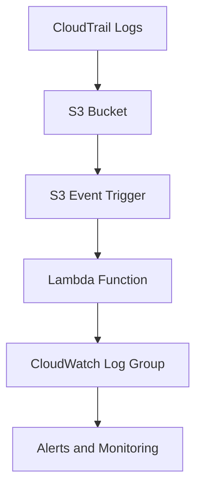

# AWS Cloud Security Monitoring

## About / Summary
This project demonstrates a **hands-on implementation of AWS Cloud Security Monitoring** using Terraform and AWS Lambda. It showcases the automation of cloud infrastructure, secure log collection, and real-time monitoring of security events. The solution is designed to help organizations maintain a strong security posture by detecting anomalous activity in AWS accounts.

---

## Abstract
The project focuses on automating AWS security monitoring using infrastructure as code. Key objectives include:

- Deploying a **CloudTrail trail** to log all AWS account activity.
- Storing logs in a **versioned S3 bucket** with strict access controls.
- Streaming logs to **CloudWatch Log Groups** for monitoring and analysis.
- Using a **Lambda function** to ingest and process logs automatically.
- Implementing Terraform for repeatable, consistent infrastructure deployment.

This setup enables real-time visibility into security events, supports compliance, and provides a foundation for automated cloud security operations.

## Architecture Diagram

## Workflow
1. **Terraform Provisioning**
   - Run `terraform init` to initialize.
   - Run `terraform plan` to review changes.
   - Run `terraform apply` to provision resources:
     - CloudTrail trail
     - S3 bucket
     - CloudWatch Log Group
     - IAM role for Lambda
     - Lambda function

2. **Log Generation**
   - CloudTrail records all AWS API events.
   - Logs are stored in S3 and streamed to CloudWatch.

3. **Lambda Ingestion**
   - Lambda reads logs from CloudWatch Log Group.
   - Processes log events and stores results in CloudWatch for auditing.

